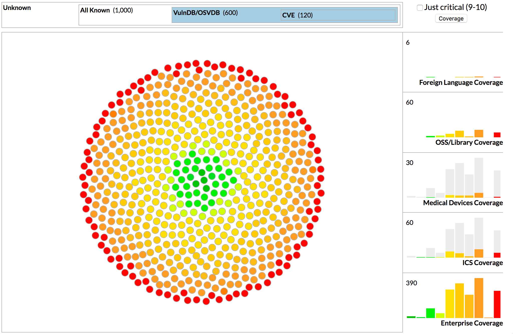

A rudimentary simulation of the breakdown of CVE-like things in various vulnerability repositories with a projection of coverage across various industries/areas.

Use `devd` or another local web server to take a look.

- `index.html` is the main one with a visually illustrative (but not "representative") CVE to VulnDB breakdown
- `ghost.html` is a version of ^^ that doesn't remove < `9-10` but ghosts them
- `8060.html` is a verison with claimed more "representative" breakdowns (I don't belive for a second that VulnDB is 80% of known vulns but )
- `ghost_8060.html` is a ghost version of ^^

There are many ways to refactor the main `js/app.js` but this was a (really) quick hack. That's no excuse, but it's the truth ;-)

I used R to gen the JSON behind the each vis.

- `prep.R` is the sim gen code for the visually illustrative version
- `prep2.R` is horribly named and is the one for the ghosts.

CVE severity distribution is pulled from CVE Details.

